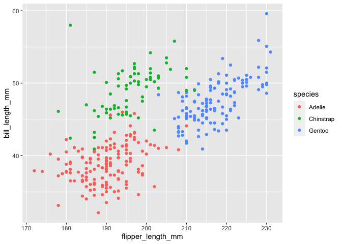

Homework 1
================
Mingee Choi
09/24/2022

# Problem 1

To find basic description of dataset:

``` r
data("penguins", package = "palmerpenguins")
summary(penguins)
```

    ##       species          island    bill_length_mm  bill_depth_mm  
    ##  Adelie   :152   Biscoe   :168   Min.   :32.10   Min.   :13.10  
    ##  Chinstrap: 68   Dream    :124   1st Qu.:39.23   1st Qu.:15.60  
    ##  Gentoo   :124   Torgersen: 52   Median :44.45   Median :17.30  
    ##                                  Mean   :43.92   Mean   :17.15  
    ##                                  3rd Qu.:48.50   3rd Qu.:18.70  
    ##                                  Max.   :59.60   Max.   :21.50  
    ##                                  NA's   :2       NA's   :2      
    ##  flipper_length_mm  body_mass_g       sex           year     
    ##  Min.   :172.0     Min.   :2700   female:165   Min.   :2007  
    ##  1st Qu.:190.0     1st Qu.:3550   male  :168   1st Qu.:2007  
    ##  Median :197.0     Median :4050   NA's  : 11   Median :2008  
    ##  Mean   :200.9     Mean   :4202                Mean   :2008  
    ##  3rd Qu.:213.0     3rd Qu.:4750                3rd Qu.:2009  
    ##  Max.   :231.0     Max.   :6300                Max.   :2009  
    ##  NA's   :2         NA's   :2

To find size of the dataset (nrow and ncol):

``` r
x=data.frame(penguins)
y=data.frame(penguins)
nrow(x)
```

    ## [1] 344

``` r
ncol(y)
```

    ## [1] 8

**Description of dataset:** \* variable names: species, island,
bill_length_mm, bill_depth_mm, flipper_length_mm, body_mass_g, sex, and
year

-   Values of important variables: \*Sex: female=165, male=168

    \*Species: Adelie=152, Chinstrap=68, Gentoo=124

    \*Island: Biscoe=168, Dream=124, Torgersen=52

    \*Means: Bill Length (mm)=43.92, Bill Depth (mm)=17.15, Body Mass
    (g)=4202

    \*Median: Bill Length (mm)=44.45, Bill Depth (mm)=17.30, Body Mass
    (g)=4050

\*Rows=334 and Columns=8

\*Mean flipper length:200.9

**Scatterplot of flipper length vs bill length** To make scatterplot
with species in different colors:

``` r
library(tidyverse)
ggplot(penguins, aes(x=flipper_length_mm, y=bill_length_mm))+geom_point(aes(color=species))
```

<!-- -->

``` r
ggsave("scatter_plot.pdf")
```

# Problem 2

Creating a dataframe

``` r
problem2_df = tibble(
  norm_samp = rnorm(n=10),
  vec_logical <- norm_samp>0,
  vec_char = c("1", "2", "3", "4", "5", "6", "7", "8", "9", "10"),
  vec_factor = factor(c(1,2,3,1,2,3,1,2,3,1)),
)
  problem2_df
```

    ## # A tibble: 10 × 4
    ##    norm_samp `vec_logical <- norm_samp > 0` vec_char vec_factor
    ##        <dbl> <lgl>                          <chr>    <fct>     
    ##  1    -0.265 FALSE                          1        1         
    ##  2    -0.783 FALSE                          2        2         
    ##  3     1.44  TRUE                           3        3         
    ##  4     2.09  TRUE                           4        1         
    ##  5    -0.262 FALSE                          5        2         
    ##  6     0.103 TRUE                           6        3         
    ##  7    -0.601 FALSE                          7        1         
    ##  8    -0.157 FALSE                          8        2         
    ##  9    -0.615 FALSE                          9        3         
    ## 10    -0.225 FALSE                          10       1

``` r
#Taking the mean of each variable in my dataframe:
mean(problem2_df$norm_samp)
```

    ## [1] 0.07305383

``` r
mean(problem2_df$vec_char)
```

    ## Warning in mean.default(problem2_df$vec_char): argument is not numeric or
    ## logical: returning NA

    ## [1] NA

``` r
mean(problem2_df$vec_logical)
```

    ## Warning: Unknown or uninitialised column: `vec_logical`.

    ## Warning in mean.default(problem2_df$vec_logical): argument is not numeric or
    ## logical: returning NA

    ## [1] NA

``` r
mean(problem2_df$vec_factor)
```

    ## Warning in mean.default(problem2_df$vec_factor): argument is not numeric or
    ## logical: returning NA

    ## [1] NA

Finding the mean of a random sample of size 10 from a standard normal
distribution (a) works, but finding the mean of the logical vector,
character vector, and factor vector doesn’t work.

``` r
as.numeric(problem2_df$vec_char)
as.numeric(problem2_df$vec_logical)
as.numeric(problem2_df$vec_factor)
```

Numerical values are assigned to the different vectors. The logical
vector takes a value of 1 (“True”) or 0 (“False”). The character vector
takes on values from 1-10, and the factor vector takes on values I
assigned. Since I can only take the mean of numerical values, this
explains why I couldn’t take the mean of the logical, character, and
factor values before I converted them into numerical values.
